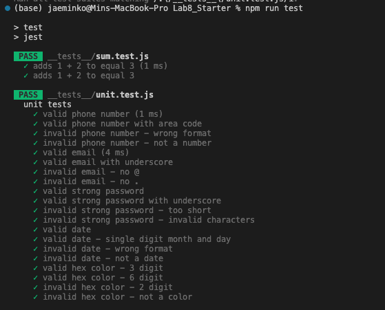
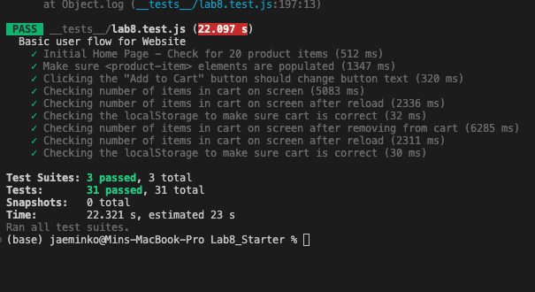

# Lab 8 - Starter

## Answer to questions
The answer to the question would be 1, Within a Github action that runs whenever code is pushed. This way one cna check if the code functions as intended right after pushing without manual action.

Question 2: Yes.

Question 3: Yes, although we would have to split up the "messaging" feature into several smaller functions. There should be a unit test to cover writing to message, and then sending the message, receiving the message, etc.

Question 4: Yes. This can be easily done using regex or by accessing the text inside the field using shadowDOM.

## Screenshots

